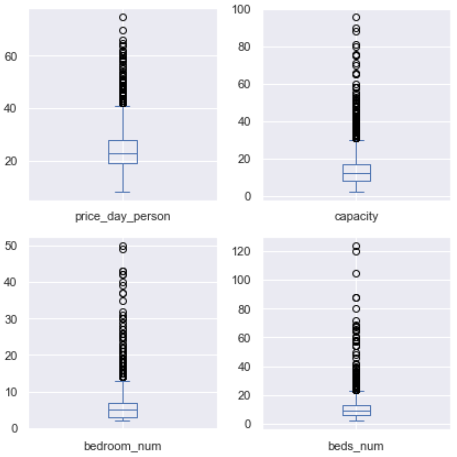
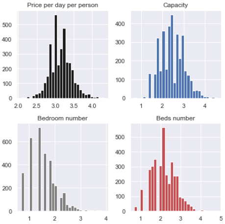
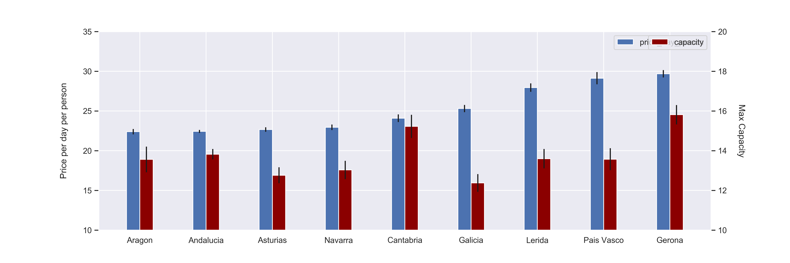
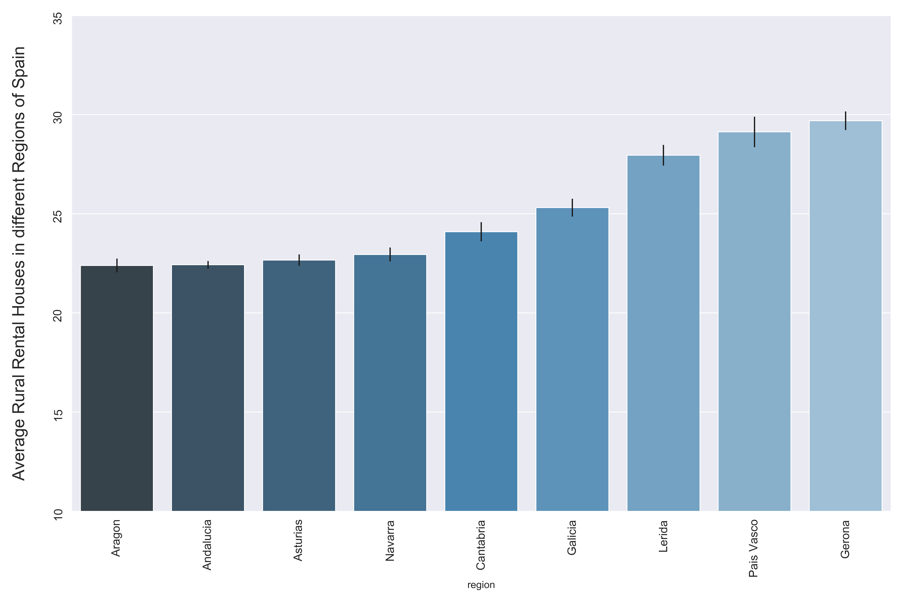

# Rental_prices_rural_houses

In this repo I performed some data scrapping and performed EDA of rural rental prices in different areas of Spain.

* Scraped over 3000 house rent information from https://www.escapadarural.com using python and the beautifulsoup library.

* Performed data cleaning steps and removed outliers.

* The EDA allowed me to get an idea of the differences in rental prices among the different areas in Spain.

### Code and Resources Used

**Python Version**: 3.7

**Packages**: pandas, numpy, beautifulsoup, matplotlib.

See below some highlight figures:

     

    

 
